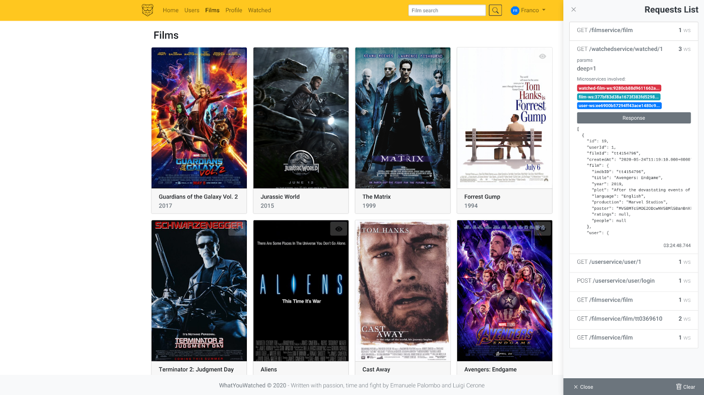

# WHATYOUWATCHED - SOSE 2019/20



## What it is

*WYW* is a very simplified version of [trakt.tv](https://trakt.tv/).  
It's been written as a playground for a scalable microservices architecture, based on choreography communication pattern. 

The stack:
* **Backend:** Docker(-compose), SpringBoot, SpringCloud, Eureka, Zuul, Ribbon, Feign, Hystrix, Apache CXF and MariaDB
* **Frontend:** Vue.js and Bootstrap(Vue)

## Install

```
# install need build and deploy package
apt-get install docker-compose maven npm
# build backend
mvn clean package
# build frontend
cd frontend
npm install
npm run build
cd ..
# run the containers
docker-compose -f docker-compose.yml [-f docker-compose.prod.yml] up [-d]
```


## Typically development flow

### Start containers

 A key for [OMDB API](http://www.omdbapi.com/apikey.aspx) is required if you want to obtain film ratings.
 Before running, export the key with:
 
 `export OMDB_API_KEY="MY_KEY"`
 
* Normal:  
    `docker-compose up (-d)`
* Development (eg. JPDA):  
    `docker-compose -f docker-compose.yml -f docker-compose.dev.yml up`
    
> **note:** see `docker-compose.yml` for more information. Tomcat port change between `4000-4100`, use `docker ps` to spot it 

### Build and Deploy

* Whole project:   
    `mvn (clean) package` from the project root
* Single microservices:  
    * `mvn -pl microservices/person package` or 
    * `cd microservices/<name> && mvn package`

> **note**: tomacat auto-reload the new war after a `mvn package`...if doesn't happen restart it (`docker-compose restart <service-name>`)  
    
### Container scaling

 * Scale on start:  
    `docker-compose up --scale person-ws=3`
 * Scale after start:  
    `docker-compose up`   
    `docker-compose scale person-ws=3`
    
### Services

All microservices are visible by eureka [localhost:8761](http://localhost:8761) 
and [localhost:8761/eureka/apps](http://localhost:8761/eureka/apps) for display what others microservices can see (xml format). 

### Frontend

 * Deployment: [http://localhost:8080/](http://localhost:8080/)   
    `cd frontend && npm run serve`
 * Deploy for distribution: [http://localhost:3000/](http://localhost:3000/)   
    `cd frontend && npm run build`
    
### DB Web Clint (Adminer)

url: [http://localhost:5000/](http://localhost:5000/)  
server: *eg. person-db*  
user: *sose*    
pwd: *sose*    
db: *sosedb*  
    
### Utils
 
 * Archetype (generate a new REST web service) ([readme.md](microservices/rest-ws-archetype/README.md))
 * Script for init the wyw DB scraping the IMDB website. ([readme.md](utils/imdb2sql/README.md))  
    `utils/imdb2sql.py`  

## Notes

All WYW users password is `qwerty`.  
Add needed dependencies to the root `pom.xml` or the children ones.  
Create needed services/networks to the `docker-compose.yml`.

## Development Guidelines

* [Commit Message Guidelines](https://gist.github.com/robertpainsi/b632364184e70900af4ab688decf6f53)
